<p align="center">
  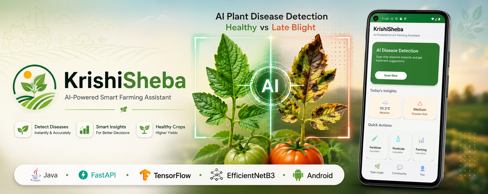
</p>

<h1 align="center">
🌿 KrishiSheba
</h1>

<p align="center">
<b>AI-Powered Plant Disease Detection Android Application</b>
</p>

<p align="center">
Helping farmers diagnose crop diseases using Deep Learning, Computer Vision, and FastAPI.
</p>

<p align="center">


</p>

<p align="center">


</p>

---

<p align="center">

⭐ AI Disease Detection

📷 Camera & Gallery Support

🧠 Custom EfficientNetB3 Model

🌦 Weather Information

🌱 Crop Library

⚡ FastAPI Inference Engine

</p>

## 📖 Project Overview

**KrishiSheba** is an AI-powered Android application designed to assist farmers, students, and agricultural enthusiasts in identifying plant diseases through deep learning. By combining modern Android development with a custom-trained computer vision model, the application delivers fast and intelligent disease diagnosis directly from leaf images.

Users can capture a photo using their device's camera or upload an existing leaf image. The image is sent to a FastAPI backend for inference, where a custom-trained **EfficientNetB3** model analyses it and returns the predicted disease along with its confidence score. Beyond simple classification, KrishiSheba provides comprehensive agricultural guidance, including disease causes, symptoms, treatment recommendations, and preventive measures to support informed decision-making.

In addition to AI-powered disease detection, the application integrates weather information and a crop library, making it a practical companion for everyday agricultural use. The project demonstrates the integration of **Android**, **FastAPI**, and **TensorFlow** into a complete end-to-end AI solution, showcasing mobile development, backend engineering, RESTful API design, and deep learning within a single application.

> **KrishiSheba is more than an image classifier—it's a full-stack AI-powered agricultural assistant that bridges mobile technology and machine learning to make plant disease diagnosis more accessible.**


## 🌟 Why KrishiSheba?

- 🤖 **Custom AI Model** trained on the PlantVillage dataset using EfficientNetB3.
- 📱 **Native Android Application** built with Java, XML, Material Design, and RecyclerView.
- ⚡ **FastAPI Backend** serving real-time AI predictions through REST APIs.
- 🌦 **Integrated Weather Module** to provide contextual farming information.
- 🌿 **Crop Knowledge Base** for exploring crop information within the app.
- 🩺 **Actionable Disease Guidance** including causes, symptoms, treatment, and prevention.
- 🧩 **Modular Full-Stack Architecture** designed with clear separation between mobile, backend, and AI components.


## 🎬 Demo & Application Showcase

Experience KrishiSheba in action through the application demo and interface previews below.

### 📽️ Application Demo

<p align="center">
  
</p>

<p align="center">
  <i>AI-powered disease detection workflow from image selection to intelligent recommendations.</i>
</p>

---

## 📱 Application Screenshots

<table align="center">
<tr>
<td align="center">
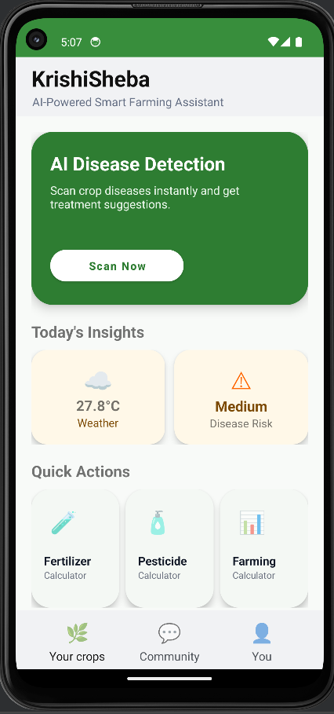<br>
<b>🏠 Home Dashboard</b><br>
<sub>Quick access to all core modules.</sub>
</td>

<td align="center">
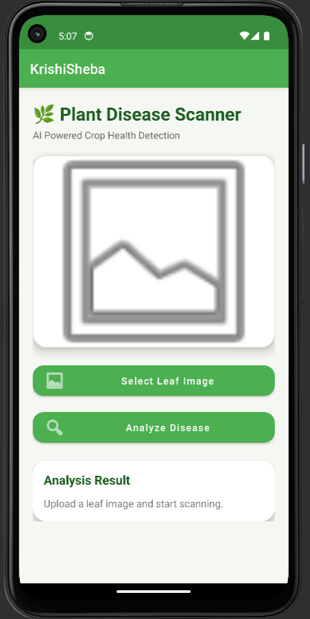<br>
<b>📷 Disease Scanner</b><br>
<sub>Capture or upload a leaf image.</sub>
</td>

<td align="center">
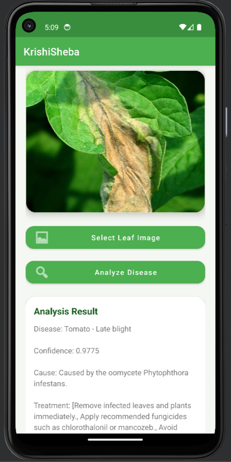<br>
<b>🤖 AI Prediction</b><br>
<sub>Disease name and confidence score.</sub>
</td>
</tr>

<tr>
<td align="center">
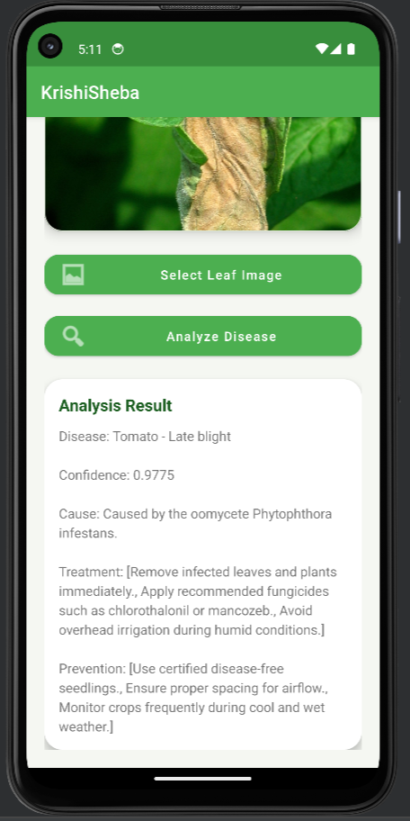<br>
<b>💡 Recommendation</b><br>
<sub>Cause, symptoms, treatment, and prevention.</sub>
</td>

<td align="center">
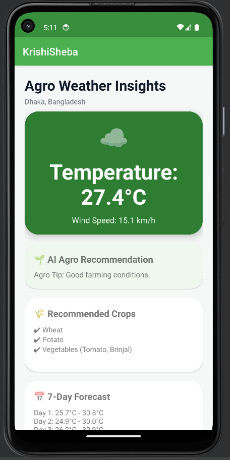<br>
<b>🌦 Weather Module</b><br>
<sub>Current weather information for farmers.</sub>
</td>

<td align="center">
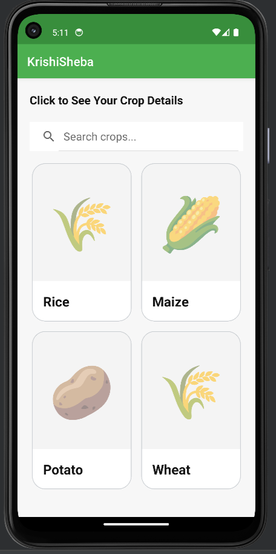<br>
<b>🌱 Crop Library</b><br>
<sub>Browse crop information and agricultural knowledge.</sub>
</td>
</tr>
</table>


## ✨ Feature Highlights

<table>
<tr>
<td width="50%">

### 🤖 AI Disease Detection
Identify plant diseases from leaf images using a custom-trained **EfficientNetB3** deep learning model served through a FastAPI backend.

</td>

<td width="50%">

### 📊 Prediction Confidence
Display the predicted disease along with a confidence score, helping users better interpret AI-generated results.

</td>
</tr>

<tr>
<td>

### 💡 Intelligent Recommendations
Receive detailed agricultural guidance including disease causes, symptoms, treatment methods, and prevention strategies.

</td>

<td>

### 📷 Camera & Gallery Support
Capture a live leaf image or select one from the device gallery for seamless disease analysis.

</td>
</tr>

<tr>
<td>

### 🌦 Weather Information
Access real-time weather information to support better farming decisions and crop management.

</td>

<td>

### 🌱 Crop Library
Explore a built-in crop knowledge base containing useful agricultural information and references.

</td>
</tr>

<tr>
<td>

### 🔐 User Authentication
Secure login and registration system for managing user access and future personalised features.

</td>

<td>

### ⚡ FastAPI Response
Powered by a FastAPI backend that performs AI inference and returns structured JSON responses with prediction details and recommendations.

</td>
</tr>

<tr>
<td>

### 📱 Native Android Experience
Built entirely with Java, XML, Material Design, RecyclerView, Retrofit, and SQLite for a responsive native experience.

</td>

<td>

### 🧠 Custom AI Model
The application uses a custom-trained EfficientNetB3 model trained on the PlantVillage dataset with 38 disease classes.

</td>
</tr>
</table>

---

## 📈 Project at a Glance

| Category | Details |
|----------|---------|
| 📱 Platform | Android |
| 🧠 AI Model | EfficientNetB3 |
| 🌿 Dataset | PlantVillage |
| 📂 Disease Classes | 38 |
| 🔌 Backend | FastAPI |
| 📡 API Format | REST / JSON |
| 💾 Local Database | SQLite |
| 🌦 Weather API | Open-Meteo |
| 📷 Image Input | Camera & Gallery |
| ⚙️ Programming Language | Java & Python |


## 🏗️ System Architecture

KrishiSheba follows a modular client-server architecture that separates the mobile application, backend services, and AI inference engine. This design keeps the Android application lightweight while allowing the machine learning model to run independently on the backend.

<p align="center">
  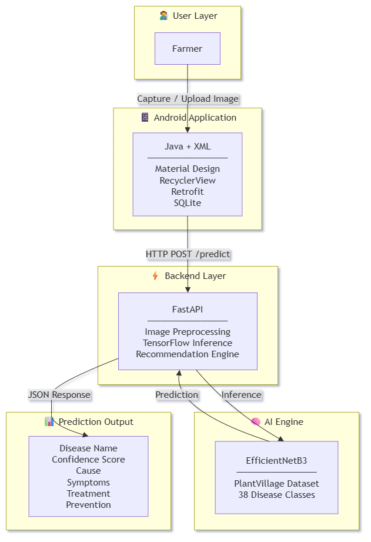
</p>

### Architecture Workflow

1. The user captures or uploads a leaf image using the Android application.
2. The Android client sends the image to the FastAPI backend through the `/predict` REST endpoint.
3. The backend preprocesses the image and performs inference using the custom-trained EfficientNetB3 model.
4. The prediction engine identifies the most likely disease and calculates the confidence score.
5. The backend enriches the prediction with agricultural guidance, including causes, symptoms, treatment options, and prevention measures.
6. A structured JSON response is returned to the Android application, where the results are displayed through an intuitive user interface.

---

### Architectural Highlights

- 📱 Native Android client built with Java and XML
- 🔗 RESTful communication using Retrofit
- ⚡ FastAPI backend for AI inference
- 🧠 Custom EfficientNetB3 deep learning model
- 📦 JSON-based API responses
- 🗂️ Modular separation of mobile, backend, and AI components

## 🧠 AI Model & Deep Learning Pipeline

KrishiSheba is powered by a **custom-trained EfficientNetB3 deep learning model** developed using TensorFlow and Keras. Instead of relying on a third-party prediction service, the model was trained on the **PlantVillage** dataset to recognise multiple plant diseases across different crops.

The trained model is deployed through a FastAPI backend, enabling real-time inference for the Android application. Each prediction is accompanied by a confidence score and enriched with disease-specific recommendations, providing users with practical agricultural guidance rather than a simple classification result.

<p align="center">
  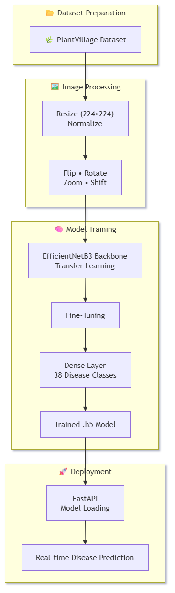
</p>

---

### Deep Learning Workflow

1. Collect plant leaf images from the PlantVillage dataset.
2. Resize all images to **224 × 224 × 3**.
3. Apply preprocessing and data augmentation.
4. Train the EfficientNetB3 model using transfer learning.
5. Fine-tune the network to improve classification performance.
6. Export the trained model in `.h5` format.
7. Load the model into the FastAPI backend.
8. Perform real-time inference for incoming Android requests.

---

### Model Configuration

| Parameter | Value |
|-----------|-------|
| Architecture | EfficientNetB3 |
| Framework | TensorFlow 2.11 |
| Keras Version | 2.11 |
| Dataset | PlantVillage |
| Input Size | 224 × 224 × 3 |
| Output Classes | 38 |
| Task | Multi-class Image Classification |
| Backend | FastAPI |
| Model Format | `.h5` |

---

### Prediction Pipeline

```text
Leaf Image
      │
      ▼
Image Preprocessing
      │
      ▼
EfficientNetB3 Model
      │
      ▼
Disease Prediction
      │
      ▼
Confidence Score
      │
      ▼
Recommendation Engine
      │
      ▼
JSON Response
      │
      ▼
Android Application
```

## 🌿 PlantVillage Dataset

KrishiSheba's disease detection model was trained using the **PlantVillage** dataset, one of the most widely used benchmark datasets for plant disease classification. The dataset contains thousands of annotated leaf images covering multiple crops and diseases, making it well suited for supervised deep learning tasks.

The images were preprocessed and resized to **224 × 224 × 3** before training the EfficientNetB3 model. Data augmentation techniques were applied to improve model generalisation and reduce overfitting.

---

### Dataset Overview

| Attribute | Value |
|-----------|-------|
| Dataset | PlantVillage |
| Total Classes | 38 |
| Image Size | 224 × 224 × 3 |
| Task | Multi-class Image Classification |
| Framework | TensorFlow / Keras |

---

### Data Preparation Pipeline

- 📂 Dataset collection
- 🖼️ Image resizing
- 🎨 Normalisation
- 🔄 Data augmentation
- 📊 Training / Validation / Test split
- 🧠 Model training

<p align="center">
  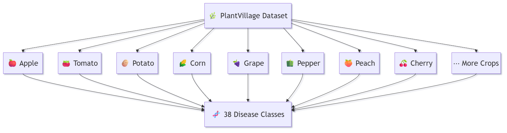
</p>


## 📊 Model Training & Evaluation

### 🌿 Dataset Preview

The EfficientNetB3 model was trained using TensorFlow and Keras on **PlantVillage** dataset, which contains annotated leaf images representing healthy and diseased crops across multiple plant species.

<p align="center">
  
</p>

<p align="center">
<i>Representative leaf samples from the PlantVillage dataset used during model training.</i>
</p>

The training process monitored both training and validation performance to ensure good generalisation while reducing the risk of overfitting. The final model was exported in `.h5` format and integrated into the FastAPI backend for real-time inference.

---

### 🏆 Final Model Performance

| Metric | Result |
|---------|--------|
| Model Architecture | EfficientNetB3 |
| Dataset | PlantVillage |
| Number of Classes | 38 |
| Input Resolution | 224 × 224 × 3 |
| Framework | TensorFlow 2.11 + Keras 2.11 |
| Training Accuracy | **99.99%** |
| Validation Accuracy | **99.82%** |
| Test Accuracy | **99.89%** |

---
> **Note:** These metrics were obtained using the PlantVillage benchmark dataset under the training and evaluation configuration described above. Real-world performance may vary depending on image quality, lighting conditions, camera characteristics, and environmental factors.


### 📈 Training History

<p align="center">
  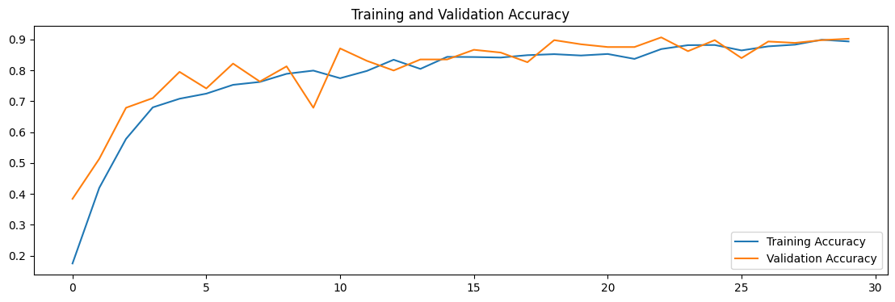

  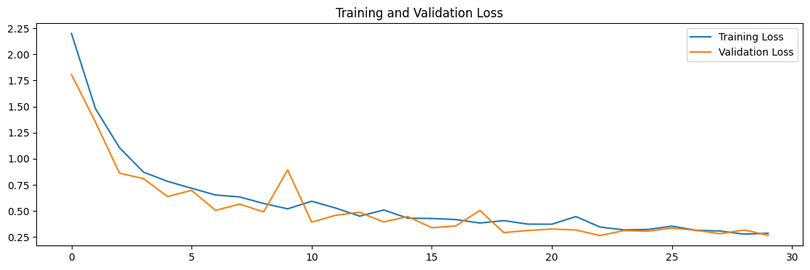
</p>

<p align="center">
<i>Training and validation metrics recorded during model training.</i>
</p>

---

### ⚙️ Training Strategy

- 🧠 Transfer learning using EfficientNetB3
- 🔄 Fine-tuning for improved classification performance
- 🖼️ Image preprocessing with 224 × 224 RGB inputs
- 🎨 Data augmentation to improve model generalisation
- 📊 Validation monitoring throughout training
- 💾 Best-performing model exported for deployment

---

### 🚀 Deployment Workflow

```text
PlantVillage Dataset
        │
        ▼
Model Training
        │
        ▼
Model Evaluation
        │
        ▼
Best Model (.h5)
        │
        ▼
FastAPI Backend
        │
        ▼
Android Application
```

## 🌾 Supported Crops & Disease Classes

The custom-trained **EfficientNetB3** model is trained on the **PlantVillage** dataset and can accurately classify **38 plant disease classes** across **13 crop categories**.

### 📊 Model Coverage

| Metric | Value |
|:-------|:-----:|
| 🌿 Supported Crops | **13** |
| 🦠 Disease Classes | **38** |
| 🤖 Deep Learning Model | **EfficientNetB3** |
| 📚 Training Dataset | **PlantVillage** |

### 🍃 Disease Categories

| Crop | Classes | Supported Disease Categories |
|:------|:-------:|:-----------------------------|
| 🍎 **Apple** | **4** | Apple Scab, Black Rot, Cedar Apple Rust, Healthy |
| 🫐 **Blueberry** | **1** | Healthy |
| 🍒 **Cherry** | **2** | Powdery Mildew, Healthy |
| 🌽 **Corn (Maize)** | **4** | Cercospora Leaf Spot (Gray Leaf Spot), Common Rust, Northern Leaf Blight, Healthy |
| 🍇 **Grape** | **4** | Black Rot, Esca (Black Measles), Leaf Blight (Isariopsis Leaf Spot), Healthy |
| 🍊 **Orange** | **1** | Huanglongbing (Citrus Greening) |
| 🍑 **Peach** | **2** | Bacterial Spot, Healthy |
| 🫑 **Bell Pepper** | **2** | Bacterial Spot, Healthy |
| 🥔 **Potato** | **3** | Early Blight, Late Blight, Healthy |
| 🍓 **Raspberry** | **1** | Healthy |
| 🌱 **Soybean** | **1** | Healthy |
| 🥒 **Squash** | **1** | Powdery Mildew |
| 🍅 **Tomato** | **10** | Bacterial Spot, Early Blight, Late Blight, Leaf Mold, Septoria Leaf Spot, Spider Mites (Two-spotted Spider Mite), Target Spot, Tomato Mosaic Virus, Tomato Yellow Leaf Curl Virus, Healthy |

> **Total Coverage:** 🌿 **13 Crops** • 🦠 **38 Disease Classes** • 🤖 **EfficientNetB3** • 📚 **PlantVillage Dataset**


## 🛠️ Technology Stack

| Layer | Technologies |
|-------|--------------|
| 📱 Android | Java, XML, Material Design, RecyclerView, Retrofit, SQLite |
| ⚙️ Backend | FastAPI, Python, TensorFlow, NumPy |
| 🧠 AI / ML | EfficientNetB3, TensorFlow 2.11, Keras 2.11 |
| 🌿 Dataset | PlantVillage |
| 🔗 API | RESTful JSON |
| 🛠️ Tools | Android Studio, VS Code, Kaggle, Git, GitHub |


## 📡 REST API

### POST `/predict`

Performs plant disease prediction using the trained EfficientNetB3 model.

#### Request

| Parameter | Type | Description |
|----------|------|-------------|
| `file` | Image | Leaf image for disease analysis |

#### Response

```json
{
  "label": "Tomato___Late_blight",
  "confidence": 0.998,
  "recommendation": {
    "cause": "...",
    "symptoms": "...",
    "treatment": [],
    "prevention": []
  }
}
```

## 📁 Project Structure

krishisheba-android/
├── README.md
├── assets/
├── KrishiSheba/          # Android application
└── krishisheba-ai/       # FastAPI backend

## ⚙️ Installation

### Android

```bash
git clone <repository-url>
```

1. Open the Android project in Android Studio.
2. Configure the backend URL if necessary.
3. Build and run the application.

### Backend

```bash
cd krishisheba-ai

python -m venv venv

pip install -r requirements.txt

uvicorn app:app --reload
```

---

# 👨‍💻 Author

<table>
<tr>
<td width="170">


</td>

<td>

## Md Sotej

**Full-Stack Developer | AI Enthusiast | Agriculture Graduate**

Passionate about building intelligent software solutions that combine **Artificial Intelligence**, **Mobile Development**, and **Backend Engineering** to solve real-world problems.

KrishiSheba represents my passion for applying modern software engineering and machine learning to agriculture, transforming research into practical technology that can benefit farmers and agricultural communities.

### 📫 Connect with Me

- 💼 LinkedIn: https://linkedin.com/in/akibuddin111
- 🐙 GitHub: https://github.com/akibuddin111
- 📧 Email: akibuddin111@gmail.com

</td>
</tr>
</table>

---

<p align="center">

⭐ If you found this project interesting, consider giving it a star.

Contributions, suggestions, and feedback are always welcome!

</p>

## 📄 License

This project is licensed under the **MIT License**. See the [LICENSE](LICENSE) file for details.